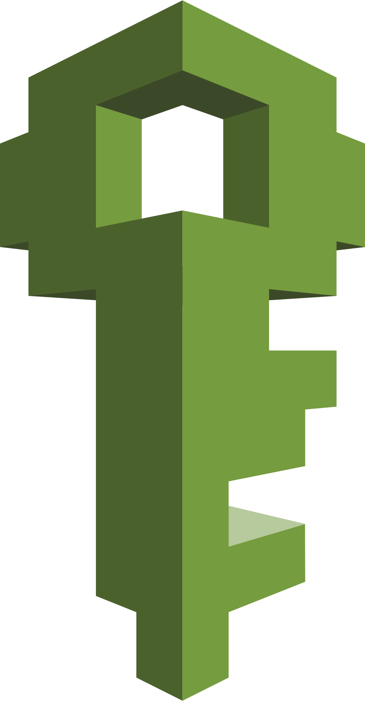

# Bonjour 👋,Je m'appelle Gauthier,Data Scientist
Connectons-nous ! 

## Domaines d'expertise
- Informatique
- Mathématiques / Statistiques
- Data Science / Machine Learning / Deep Learning
- Business / Communication / Cas d’usage

## ⚡ Technologies & Langages de programmation
### Langages et librairies : 
           
     

### Plateformes : 
   
 

## Diplômes et certifications
  
